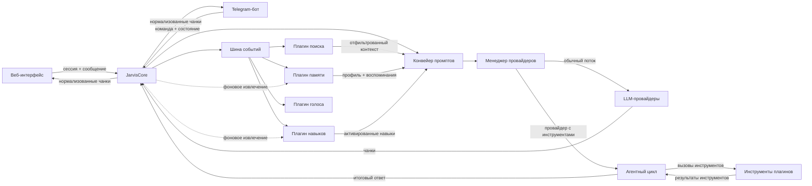

# J.A.R.V.I.S. — техническое описание

**J.A.R.V.I.S.** (Just A Rather Very Intelligent System) — персональная AI-платформа и ассистент с несколькими интерфейсами, долговременной памятью, расширяемой плагинной системой и отказоустойчивым выбором модели.


Это публичное описание проекта. В репозитории намеренно нет исходного кода, ключей, локальных путей, данных пользователей и рабочих конфигураций. Исходная система остаётся приватной; здесь показаны только принципы проектирования, потоки данных и демонстрационные материалы.

## Почему этот проект важен

J.A.R.V.I.S. — мой основной личный проект для практического применения LLM в реальной ежедневной работе. Проект объединяет оркестрацию ИИ, автоматизацию, долговременную память, инструменты и несколько интерфейсов в единую систему. Архитектура развивается вокруг принципа «сказал → сделал», а не вокруг демонстрации отдельных моделей.

## Стек технологий

| Область | Используется |
|---|---|
| Ядро | Python, FastAPI, Uvicorn, SQLite/FTS5 |
| LLM | API, совместимые с OpenAI; Groq, OpenRouter, OpenCode Zen; опционально Gemini, DeepSeek, Kimi, Claude, локальный GGUF/Ollama и мост DeepSeek Web |
| Интерфейсы | React, WebSocket, Telegram / aiogram, трей Windows |
| Архитектура | Абстракция провайдера, система плагинов, шина событий, долговременная память, агентный цикл |
| Тестирование | pytest, pytest-asyncio, smoke-тесты, регрессионные тесты WebSocket, E2E-тесты Playwright |
| Инфраструктура | Windows (основная), кроссплатформенные пути выполнения |

## Что умеет J.A.R.V.I.S.

- **Несколько интерфейсов**: веб-приложение с потоковой передачей ответа и Telegram-бот.
- **Поставщики LLM**: единый контракт для разных поставщиков и моделей.
- **Резервный провайдер**: последовательный переход к резервному провайдеру при недоступности, лимите или ошибке.
- **Потоковая передача**: построчная передача ответа и понятное состояние соединения.
- **Долгосрочная память**: локальное SQLite-хранилище, извлечение фактов, профиль пользователя и поиск по воспоминаниям.
- **Система плагинов**: подключаемые модули, события, инструменты и жизненный цикл через манифесты.
- **Маршрутизация намерений**: определение потребности в актуальном веб-поиске до сборки основного запроса.
- **Поиск в вебе**: получение контекста, его фильтрация и передача модели вместе с источниками.
- **Слой безопасности**: разделение внешних данных и инструкций, фильтрация инъекций, минимизация раскрытия контекста.
- **Операционная наблюдаемость**: состояние провайдеров, квоты, состояние модулей и журналы работы.

## Архитектура

Это логическая схема текущей реализации, а не точная копия структуры исходного кода. Основные потоки следующие:



Полная схема: [assets/architecture.svg](assets/architecture.svg).

## Документация

- [Архитектура](docs/architecture.md) — логические слои, компоненты и основные потоки данных.
- [Провайдеры](docs/providers.md) — единый контракт, выбор модели, резервный провайдер, потоковая передача и состояние провайдеров.
- [Память](docs/memory.md) — извлечение, хранение, поиск и безопасность долгосрочной памяти.
- [Система плагинов](docs/plugin-system.md) — жизненный цикл модулей, события, инструменты и расширение возможностей.

Основной принцип — интерфейс не знает, какой поставщик реально выполнил запрос. Ядро собирает контекст и координирует модули, Менеджер провайдеров отвечает за доступность поставщиков, а плагины добавляют данные и инструменты через события и контракты.

## Разработка с участием ИИ

Проект активно разрабатывается с использованием ИИ-инструментов. CLI и другие LLM используются для исследования решений, декомпозиции задач, генерации и анализа кода, написания тестов и рефакторинга. Архитектурные решения, интеграция, проверка результатов и финальная валидация остаются ответственностью разработчика.

## Почему архитектура такая

**Разделение ответственности.** Веб- и Telegram-интерфейсы занимаются только транспортом: авторизацией, вводом, отображением и событиями соединения. JarvisCore остаётся единой точкой координации диалога, истории и политик безопасности. Благодаря этому одно и то же ядро можно использовать через разные интерфейсы без дублирования бизнес-логики.

**Провайдер как заменяемый адаптер.** Модель выбирается на уровне конфигурации, но ядро работает с абстрактным контрактом. Если основной поставщик недоступен, Менеджер провайдеров пробует следующий кандидат, отслеживает cooldown и передаёт пользователю понятное уведомление. Запросы плагинов используют отдельный чистый путь, чтобы вспомогательные операции не меняли активную сессию.

**Плагины расширяют, а не переписывают ядро.** Память, поиск, навыки и голос работают как модули с собственным жизненным циклом. Они подписываются на события, инжектируют ограниченный контекст в PromptPipeline или предоставляют инструменты. Такая модель позволяет добавлять возможности без увеличения монолита и без изменения контрактов интерфейсов.

## Что было сложно

- **Потоковая передача + резервный провайдер**: нужно было не переключать поставщика после начала ответа, чтобы не смешивать части одного сообщения.
- **Абстракция провайдера**: разные API имеют разные форматы ошибок, потоковой передачи и квот, но должны выглядеть для ядра единообразно.
- **Безопасность памяти**: внешние и диалоговые данные нельзя передавать модели как доверенные инструкции; нужны фильтрация, приоритеты и аудит.
- **Маршрутизация намерений**: поиск должен запускаться по смыслу запроса, а не по списку запрещённых или обязательных слов.
- **Конкурентность**: фоновые задачи памяти и поиска не должны блокировать основной цикл событий или портить текущий ответ.
- **Операционная надёжность**: опрос состояния, cooldown и понятные ошибки важны не меньше, чем сама генерация.

## Демонстрационные материалы

| Материал | Что показывает |
|---|---|
| [architecture.svg](assets/architecture.svg) | Слоистая архитектура и поток запроса |
| [web.svg](assets/web.svg) | Схематичный интерфейс веб-приложения |
| [telegram.svg](assets/telegram.svg) | Сценарий общения через Telegram |
| [memory.svg](assets/memory.svg) | Извлечение, хранение и использование памяти |

Изображения являются архитектурными мокапами и не содержат реальные данные или экраны приватной системы.

## Конфиденциальность

Исходный код является приватным, поскольку проект представляет собой личную систему. Архитектура, проектные решения и скриншоты опубликованы публично. Исходный код может быть предоставлен для технического обзора по запросу.

В публичном описании проекта намеренно не опубликованы:

- `.env` и значения API-ключей;
- токены, учетные записи и разрешённый список пользователей;
- локальные пути, имена хостов и данные процессов;
- история чатов, SQLite-базы и пользовательские факты;
- исходные файлы приватного репозитория.

## Структура публикации

```text
JARVIS-Case-Study/
├── README.md
├── docs/
│   ├── architecture.md
│   ├── providers.md
│   ├── memory.md
│   └── plugin-system.md
├── assets/
│   ├── architecture.svg
│   ├── web.svg
│   ├── telegram.svg
│   └── memory.svg
└── examples/
    ├── config.example.env
    └── plugin.example.md
```

