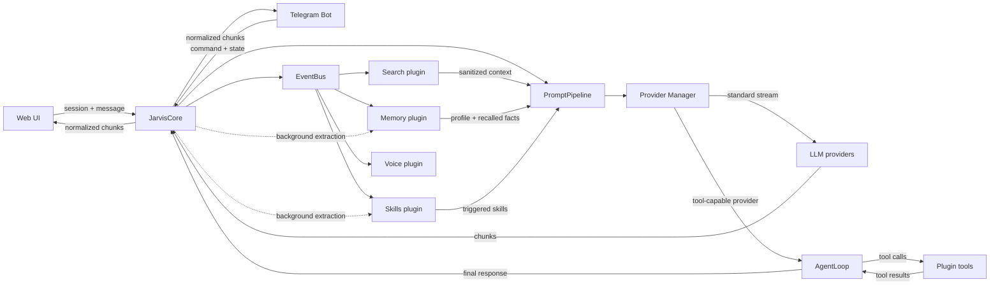

# J.A.R.V.I.S. — Technical Case Study

**J.A.R.V.I.S.** (Just A Rather Very Intelligent System) — персональная AI-платформа и ассистент с несколькими интерфейсами, долгосрочной памятью, расширяемой плагинной системой и отказоустойчивым выбором модели.

Это публичный архитектурный case study. В репозитории намеренно нет исходного кода, ключей, локальных путей, данных пользователей и рабочих конфигураций. Исходная система остаётся приватной; здесь показаны только принципы проектирования, потоки данных и демонстрационные материалы.

## Что умеет J.A.R.V.I.S.

- **Несколько интерфейсов**: веб-приложение с потоковым ответом и Telegram-бот.
- **LLM providers**: единый контракт для разных поставщиков и моделей.
- **Fallback**: последовательный переход к резервному провайдеру при недоступности, лимите или ошибке.
- **Streaming**: построчная передача ответа и понятное состояние соединения.
- **Long-term memory**: локальное SQLite-хранилище, извлечение фактов, профиль пользователя и поиск по воспоминаниям.
- **Plugin system**: подключаемые модули, события, инструменты и жизненный цикл через манифесты.
- **Intent routing**: определение потребности в актуальном веб-поиске до сборки основного запроса.
- **Web search**: получение контекста, его фильтрация и передача модели вместе с источниками.
- **Safety layer**: разделение внешних данных и инструкций, фильтрация инъекций, минимизация раскрытия контекста.
- **Operational visibility**: health-статус провайдеров, квоты, состояние модулей и журналы работы.

## Архитектура

Это логическая схема текущей реализации, а не точная копия структуры исходного кода. Основные потоки следующие:



Полная схема: [assets/architecture.svg](assets/architecture.svg).

Основной принцип — интерфейс не знает, какой поставщик реально выполнил запрос. Core собирает контекст и координирует модули, Provider Manager отвечает за доступность поставщиков, а плагины добавляют данные и инструменты через события и контракты.

## Почему архитектура такая

**Разделение ответственности.** Web и Telegram занимаются только транспортом: авторизацией, вводом, отображением и событиями соединения. JarvisCore остаётся единой точкой координации диалога, истории и политик безопасности. Благодаря этому один и тот же ядро можно использовать через разные интерфейсы без дублирования бизнес-логики.

**Провайдер как заменяемый адаптер.** Модель выбирается на уровне конфигурации, но ядро работает с абстрактным контрактом. Если основной поставщик недоступен, Provider Manager пробует следующий кандидат, отслеживает cooldown и передаёт пользователю понятное уведомление. Запросы плагинов используют отдельный чистый путь, чтобы вспомогательные операции не меняли активную сессию.

**Плагины расширяют, а не переписывают ядро.** Память, поиск, навыки и голос работают как модули с собственным жизненным циклом. Они подписываются на события, инжектируют ограниченный контекст в PromptPipeline или предоставляют инструменты. Такая модель позволяет добавлять возможности без увеличения монолита и без изменения контрактов интерфейсов.

## Что было сложно

- **Streaming + fallback**: нужно было не переключать поставщика после начала ответа, чтобы не смешивать части одного сообщения.
- **Provider abstraction**: разные API имеют разные форматы ошибок, стриминга и квот, но должны выглядеть для ядра единообразно.
- **Memory safety**: внешние и диалоговые данные нельзя передавать модели как доверенные инструкции; нужны фильтрация, приоритеты и аудит.
- **Intent routing**: поиск должен запускаться по смыслу запроса, а не по списку запрещённых или обязательных слов.
- **Конкурентность**: фоновые задачи памяти и поиска не должны блокировать основной event loop или портить текущий ответ.
- **Операционная надёжность**: health polling, cooldown и понятные ошибки важны не меньше, чем сама генерация.

## Демонстрационные материалы

| Материал | Что показывает |
|---|---|
| [architecture.svg](assets/architecture.svg) | Слоистая архитектура и поток запроса |
| [web.svg](assets/web.svg) | Схематичный интерфейс веб-приложения |
| [telegram.svg](assets/telegram.svg) | Сценарий общения через Telegram |
| [memory.svg](assets/memory.svg) | Извлечение, хранение и использование памяти |

Изображения являются архитектурными мокапами и не содержат реальные данные или экраны приватной системы.

## Конфиденциальность

Source code is private because the project is a personal system. Architecture, implementation decisions and screenshots are documented publicly. Source access can be provided for technical review upon request.

В публичном case study намеренно не опубликованы:

- `.env` и значения API-ключей;
- токены, учетные записи и allowlist пользователей;
- локальные пути, имена хостов и данные процессов;
- chat history, SQLite-базы и пользовательские факты;
- исходные файлы приватного репозитория.

## Структура публикации

```text
JARVIS-Case-Study/
├── README.md
├── docs/
│   ├── architecture.md
│   ├── providers.md
│   ├── memory.md
│   └── plugin-system.md
├── assets/
│   ├── architecture.svg
│   ├── web.svg
│   ├── telegram.svg
│   └── memory.svg
└── examples/
    ├── config.example.env
    └── plugin.example.md
```
