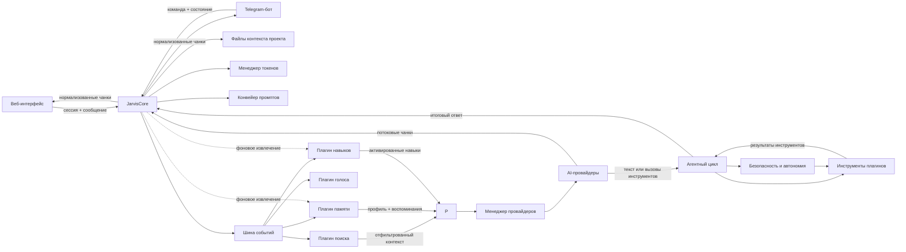

# Архитектура

## Область документа

Этот документ описывает публичный архитектурный контракт J.A.R.V.I.S. Он намеренно не публикует исходный код, учетные данные, локальные пути, данные пользователей или операционные секреты.

Система имеет четыре основных логических слоя: интерфейсы, ядро, плагины и провайдеры. Ниже показан публичный контракт, а не буквальная копия приватной структуры исходников.

## Ответственность компонентов

| Компонент | Ответственность |
|---|---|
| Веб-интерфейс | FastAPI REST API, WebSocket-транспортировка, состояние сессии, отображение чатов и подтверждение действий |
| Telegram-интерфейс | aiogram v3, аутентификация, маршрутизация команд и состояние разговора для каждого пользователя |
| JarvisCore | Асинхронная оркестрация диалога, история, бюджет контекста, события, провайдеры и плагины |
| Конвейер промптов | Последовательное формирование системных инструкций, контекста плагинов, истории и текущего сообщения |
| Менеджер провайдеров | Фабрика провайдеров, порядок кандидатов, резервный провайдер, пауза восстановления, контрольный таймаут первого чанка и состояние здоровья |
| Агентный цикл | Цикл вызова инструментов, повторные витки до лимита и нормализация результатов |
| Плагин памяти | Извлечение фактов, SQLite/FTS5, профиль, поиск, суммаризация и фильтры безопасности |
| Плагин поиска | Классификация намерения, DuckDuckGo, кэширование, санитизация и инжекция контекста |
| Плагин навыков | Извлечение процедурного опыта и предоставление проверенных навыков агенту |
| Плагин голоса | TTS и STT с несколькими провайдерами |
| Система плагинов | Обнаружение, жизненный цикл, события, команды, инструменты и состояние модулей |
| Шина событий | Синхронная и асинхронная коммуникация между компонентами |
| Безопасность и автономия | Риски команд, подтверждение, песочница, аудит и уровни доверия |
| Менеджер токенов | Оценка контекста, обрезка истории и выделение бюджета памяти |
| Журнал / состояние | Наблюдаемость без публикации ключей и сырых приватных сообщений |

## Поток запроса

1. Интерфейс принимает сообщение пользователя и добавляет минимальный контекст сессии.
2. JarvisCore сохраняет сообщение и публикует событие `MESSAGE_RECEIVED`.
3. Плагины просматривают событие: поиск классифицирует намерение, память и навыки готовят релевантный контекст.
4. Менеджер токенов оценивает бюджет и при необходимости обрезает историю.
5. Файлы контекста проекта загружаются и добавляются в системную часть промпта до пользовательского сообщения.
6. Конвейер промптов формирует упорядоченный список сообщений: системная политика, контекст проекта, контекст плагинов, история и текущее сообщение.
7. Менеджер провайдеров выбирает основного или резервного провайдера и запускает обычный или потоковый запрос.
8. Если провайдер поддерживает инструменты, агентный цикл выполняет витки вызова инструментов до лимита и возвращает результаты в нормализованном виде.
9. Вызовы инструментов проходят шлюз безопасности: классификацию риска, политику автономии, карту возможностей, ворота подтверждения и исполнителя песочницы.
10. После ответа история сохраняется, публикуется `MESSAGE_PROCESSED`, а фоновые плагины могут начать извлечение памяти и навыков.

Плагин может вернуть ответ через метод `BaseModule.on_message()`. Если он возвращает непустую строку, ядро записывает её как ответ ассистента и пропускает обращение к LLM-провайдеру. В манифесте нет поля `override_response`.

## Границы данных

- Интерфейсы передают только входящие данные пользователя и идентификаторы сессий.
- JarvisCore относится к внешнему содержимому как к данным, а не как к доверенным инструкциям.
- Результаты плагинов проходят санитизацию и получают приоритет перед попаданием в Конвейер промптов.
- Файлы контекста проекта считаются частью системного контекста и должны редактироваться только доверенным разработчиком.
- Ответы провайдеров нормализуются до передачи интерфейсам.
- Локальная память хранится отдельно от истории чата и извлекается по релевантности.
- Логи и эндпоинты состояния показывают операционное состояние, но не ключи и не сырые приватные данные.

## Обработка отказов

- Отсутствие ключа или зависимости исключает кандидата из активной цепочки.
- После ошибки провайдер переходит в cooldown, чтобы не отправлять каждый запрос на недоступный endpoint.
- Резервный провайдер для потокового ответа возможен только до получения первого чанка; после начала ответа модель не смешивается.
- Ошибки поиска и памяти являются fail-open: основной ответ продолжается без них.
- Ошибка отдельного опционального плагина не завершает основной диалог.
- Полная недоступность всех провайдеров возвращается пользователю как краткая ошибка и сохраняется в истории.
- Ошибка инструмента нормализуется, попадает в аудит и не должна приводить к смешиванию ответа с другим провайдером.

## Границы безопасности

- Аутентификация выполняется на границе интерфейса.
- Поиск, память и другие внешние данные санитизируются перед инжекцией в промпт.
- API-ключи хранятся только в конфигурации окружения и не выводятся в документации или логах.
- Команды классифицируются как `SAFE`, `ELEVATED`, `DANGEROUS` или `FORBIDDEN`.
- Карта возможностей по умолчанию запрещает неизвестные действия плагинов.
- Ворота подтверждения запрашивают подтверждение для повышенных и опасных действий.
- Исполнитель песочницы использует `shell=False`, изоляцию путей, разрешенный список исполняемых файлов и блокировку shell-метасимволов.
- Политика автономии реализует уровни доверия `L0_ASK`, `L1_SUPERVISED`, `L2_TRUSTED_TOOL`, `L3_TRUSTED_PATTERN` и `L4_AUTONOMOUS`.
- Доверенные шаблоны имеют TTL: по умолчанию 24 часа, значение `0` означает постоянное доверие.
- Действия и результаты инструментов записываются в журнал аудита; истекшие правила помечаются как недействительные.
- Результаты инструментов проверяются перед инъекцией обратно в модель.
- Публичная документация описывает возможности и контракты без публикации секретов реализации.

См. [визуальную схему](../assets/architecture.svg) для обзора архитектуры.
