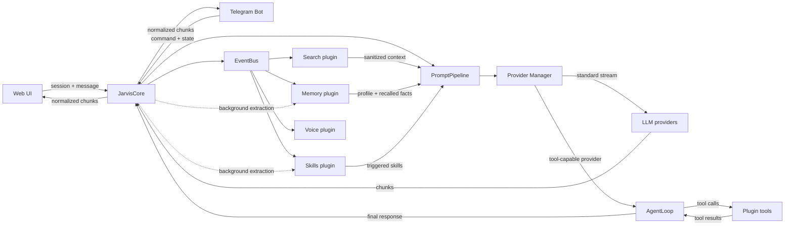

# Architecture

## Scope

This document describes the public architectural contract of J.A.R.V.I.S. It is intentionally implementation-neutral: it does not publish source code, credentials, local paths, user data, or operational secrets.

The system has four logical layers. The diagram below shows the public architectural contract rather than a literal copy of the private source layout:

## Component responsibilities

| Component | Responsibility |
|---|---|
| Web interface | Browser UI, WebSocket transport, session state, chat rendering |
| Telegram interface | Bot authentication, command routing, per-user conversation state |
| JarvisCore | Dialogue orchestration, history, policy coordination, plugin coordination |
| PromptPipeline | Ordered construction of system context, history, plugins, and current user message |
| Provider Manager | Provider factory, candidate ordering, fallback, streaming watchdog, health state |
| Memory plugin | Fact extraction, local storage, profile, recall, summarization, safety filters |
| Search plugin | Intent classification, web results, sanitization, context injection |
| Plugin system | Discovery, lifecycle, event subscriptions, tools, status reporting |
| Event bus | Synchronous and asynchronous communication between components |
| Logger / state | Operational visibility without exposing secrets |

## Request flow

1. An interface receives a user message and attaches the minimum session context.
2. JarvisCore records the message and emits a `MESSAGE_RECEIVED` event.
3. Plugins inspect the event. Search may classify the intent; memory may prepare relevant context.
4. PromptPipeline builds an ordered message list: system policy, plugin context, history, current message.
5. Provider Manager selects a candidate provider and starts a normal or streaming request.
6. Streaming chunks are forwarded to the interface. A provider switch is allowed only before the first chunk.
7. Plugin results and provider status are published after the request completes.
8. The completed exchange becomes input for history, memory extraction, and future recalls.

## Data boundaries

- Interfaces send user-visible payloads and session identifiers only.
- Core treats external content as data, not as trusted instructions.
- Plugin output is filtered and assigned a priority before entering the prompt.
- Provider responses are normalized before reaching the interface.
- Local memory is stored separately from chat history and is recalled by relevance.
- Logs and health endpoints expose operational state, not secrets or raw private payloads.

## Failure handling

- Missing credentials or unsupported models remove a candidate from the active chain.
- A provider error applies a cooldown so repeated requests do not immediately hammer an unavailable endpoint.
- Streaming fallback is disabled after the first chunk to preserve answer integrity.
- Search and memory failures are fail-open: the primary response continues without them.
- A total provider failure is returned as a concise user-facing error and retained in history.

## Security boundaries

- Authentication belongs at the interface boundary.
- External search results and memory records are sandboxed before prompt injection.
- API keys remain in environment configuration and are never rendered in documentation or logs.
- Public documentation describes capabilities and contracts without publishing implementation secrets.

See [architecture.svg](../assets/architecture.svg) for a visual overview.
